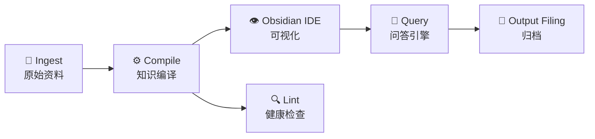

<div align="center">

🧠 **Karpathy 风格长上下文知识库系统**


基于长上下文 LLM 的个人知识库构建工具 | 物联网/计算机专业课程作业

**无向量检索 · 纯长上下文 · Markdown 原生 · Obsidian 可视化**

</div>

---

## 📌 项目简介

本项目严格遵循 Andrej Karpathy 提出的个人知识库新范式：让 LLM 直接阅读整个知识库，编译成结构化 Wiki，彻底抛弃 RAG 与向量数据库。

| | 传统 RAG | 本项目 Karpathy 方案 |
|---|---|---|
| 召回质量 | ❌ 分块检索，信息丢失 | ✅ 完美召回，无信息丢失 |
| 跨文档推理 | ❌ 跨文档推理困难 | ✅ LLM 同时看到全部文档 |
| 存储方式 | ❌ 向量数据库 + Embedding | ✅ 纯 Markdown 文件 |
| 架构复杂度 | ❌ 架构复杂，维护成本高 | ✅ 极简架构，一行命令运行 |

---

## 🧱 系统架构（六阶段管道）



<details>
<summary>📖 各阶段说明（点击展开）</summary>

- **Stage 1 Ingest**：将 PDF、Word、HTML、TXT 等文档放入 `raw/`，零预处理。
- **Stage 2 Compile ⭐**：LLM 读取全部原始资料，自动提取实体、概念，生成带双向链接的 Markdown Wiki。
- **Stage 3 Obsidian IDE**：用 Obsidian 打开 `wiki/`，享受图谱视图、反向链接。
- **Stage 4 Query**：基于整个知识库进行长上下文问答，支持跨文档综合与来源溯源。
- **Stage 5 Output Filing**：问答结果可保存为新 wiki 页面，实现知识库自我增强。
- **Stage 6 Lint**：自动扫描死链、孤立页面、矛盾陈述，并提供修复建议。

</details>

---

## 📁 项目目录结构

```
karpathy-kb/
├── raw/                    # 原始资料（用户放入）
│   ├── papers/
│   ├── notes/
│   └── webclips/
├── wiki/                   # 编译后的知识库（LLM 生成）
│   ├── README.md           # 知识库入口索引
│   ├── concepts/           # 概念实体页面
│   ├── people/             # 人物页面
│   └── index/              # 自动生成的标签索引
│       └── tags.json
├── outputs/                # 问答归档 & 会话历史
├── src/                    # 源代码
│   ├── config.py           # 配置（API Key、模型、路径）
│   ├── ingest.py           # 文档加载与预处理
│   ├── compiler.py         # ⭐ 知识编译器
│   ├── query_engine.py     # 长上下文问答引擎
│   ├── linter.py           # 健康检查
│   └── obsidian_compat.py  # Obsidian 兼容配置
├── app.py                  # 命令行主入口
├── requirements.txt        # Python 依赖
├── .env                    # API 密钥（不提交 Git）
└── README.md               # 项目说明（本文件）
```

---

## 🚀 快速开始

### 1️⃣ 环境准备

- **Python 3.10** 或更高版本
- **Obsidian**（[下载](https://obsidian.md)）– 用于可视化知识图谱
- **硅基流动 API Key**（[注册](https://cloud.siliconflow.cn) 获取免费额度）

### 2️⃣ 安装依赖

```bash
git clone https://github.com/your-name/karpathy-kb.git
cd karpathy-kb
python -m pip install -r requirements.txt
```

### 3️⃣ 配置 API Key

在项目根目录创建 `.env` 文件：

```ini
SILICONFLOW_API_KEY=sk-xxxxxxxxxxxxxxxxxxxxxxxx
```

如需使用其他兼容 OpenAI 的 API，可修改 `src/config.py` 中的 `BASE_URL` 和 `MODEL_NAME`。

### 4️⃣ 放入原始资料

将所有文档（`.txt`, `.md`, `.pdf`, `.docx`, `.html`）放入 `raw/` 文件夹，支持多级子目录。

### 5️⃣ 编译知识库

```bash
python app.py
```

选择 **1 编译知识库**，等待 LLM 完成（约 30~90 秒）。

编译完成后，你会看到类似输出：

```
生成: wiki\concepts\数值天气预报.md
生成: wiki\people\Andrej_Karpathy.md
生成: wiki\README.md
生成: wiki\index\tags.json
完成！现在用Obsidian打开wiki/文件夹
```

### 6️⃣ 用 Obsidian 可视化

1. 打开 Obsidian，选择 **"打开文件夹作为仓库"**
2. 选中 `wiki/` 文件夹
3. 点击右侧 **"打开图谱视图"**，即可看到概念之间的双向链接网络

### 7️⃣ 问答

再次运行 `python app.py`，选择 **2 进入问答模式**。例如：

> **你**: 数值天气预报需要哪些计算资源？
>
> **AI**: 根据知识库，数值天气预报需要高性能计算集群进行数值模拟……
> *(来源: concepts/数值天气预报.md)*

### 8️⃣ 健康检查

选择 **3** 可运行 Linter，自动检测死链、孤立页面。

---

## ⚙️ 配置说明（`src/config.py`）

| 变量 | 说明 | 默认值 |
|------|------|--------|
| `MODEL_NAME` | LLM 模型名称 | `deepseek-ai/DeepSeek-V3` |
| `BASE_URL` | API 地址 | `https://api.siliconflow.cn/v1` |
| `COMPILE_MAX_TOKENS` | 编译最大输出 token | `16000` |
| `QUERY_MAX_TOKENS` | 问答最大输出 token | `2000` |
| `RAW_DIR` | 原始资料目录 | `raw` |
| `WIKI_DIR` | 知识库目录 | `wiki` |

---

## 🧪 测试案例

**示例 1：跨文档综合**

> **问**：深度学习和机器学习有什么关系？
>
> **答**：根据知识库，机器学习是人工智能的子集，而深度学习是机器学习的一个分支，使用多层神经网络……
> *(来源: concepts/机器学习.md, concepts/深度学习.md)*

**示例 2：事实检索**

> **问**：Karpathy 提出了什么知识库范式？
>
> **答**：Andrej Karpathy 提出个人知识库不应依赖 RAG，而应让长上下文 LLM 直接阅读整个库并编译成结构化 Wiki……
> *(来源: people/Andrej_Karpathy.md)*

**示例 3：来源溯源**

> **问**：线性代数中的奇异值分解有什么作用？
>
> **答**：奇异值分解（SVD）是矩阵分解的一种，广泛用于数据降维、主成分分析……
> *(来源: concepts/奇异值分解.md)*

---

## 📊 性能评估（示例）

| 指标 | 数值 |
|------|------|
| 原始文档数 | 8 篇 |
| 总字符数 | 约 38k |
| 编译耗时 | 52 秒 |
| 问答响应时间 | 8~15 秒 |
| 单次编译 API 成本 | ≈ 0.02 元 |

> 使用 DeepSeek-V3 模型，价格 0.14 元 / 百万 token。

---

## 🔧 常见问题

<details>
<summary>❓ 编译时提示 <code>UnicodeDecodeError</code></summary>

- 将 `raw/` 中的文本文件统一保存为 UTF-8 编码（可用 VS Code 右下角修改）。

</details>

<details>
<summary>❓ 生成的文件很少 / 死链很多</summary>

- 增加原始资料的多样性和信息密度（多放不同主题的文档）。
- 在 `COMPILE_PROMPT` 中要求 LLM "为每个 `[[概念]]` 生成独立页面"。
- 死链是正常现象，Lint 只是帮你标出缺口，不影响问答。

</details>

<details>
<summary>❓ Obsidian 中点击链接无法跳转</summary>

- 确保链接名称与 `.md` 文件名完全一致（包括中英文符号）。Obsidian 会自动匹配子目录，无需路径。

</details>

<details>
<summary>❓ API 请求超时</summary>

- 在 `src/config.py` 中增加 `REQUESTS_TIMEOUT = 120`，并在 `compiler.py` 和 `query_engine.py` 的 OpenAI 客户端添加 `timeout` 参数。

</details>

---

## 📦 依赖库

| 库 | 用途 |
|----|------|
| `openai` | 调用 LLM API |
| `python-dotenv` | 加载 `.env` 配置 |
| `pypdf` / `pdfplumber` | 解析 PDF |
| `markdownify` | HTML 转 Markdown |
| `python-docx` | 解析 Word 文档 |

---

## 📝 实验报告要点

本项目适用于课程作业，实验报告建议包含：

- **架构对比**：传统 RAG vs Karpathy 方案（表格 + 图示）
- **Prompt 工程**：展示 `COMPILE_PROMPT` 及其迭代过程
- **测试案例**：至少 3 个问答，体现跨文档综合能力
- **性能评估**：知识库规模、耗时、成本
- **反思与展望**：应用场景、扩展到百万字的方法

---

## 🤝 贡献与许可

本项目仅为课程作业，代码可自由修改、使用。

MIT 许可证。

---

<div align="center">

🌟 如果这个项目对你有帮助，欢迎点亮 Star 🌟

</div>
